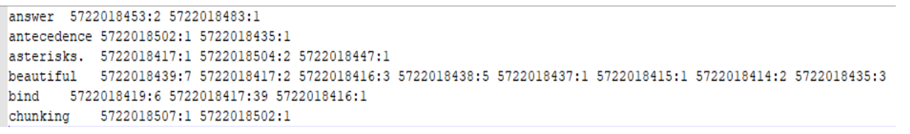

# CSCI-572 Homework 03

### Requirements

1. Java: 19.0.1 Temurin
2. Gradle: 7.6

### Quick Start

1. Clone this project [https://github.com/daveaditya/CSCI_572_IR](https://github.com/daveaditya/CSCI_572_IR)

2. Install SDKMAN! and Java

```bash
$ curl -s "https://get.sdkman.io" | bash # install SDKMAN! (https://sdkman.io)

$ source "$HOME/.sdkman/bin/sdkman-init.sh" # add SDKMAN! to shell start

$ sdk --version # should return sdk man version

$ sdk install java 19.0.1-tem
```

3. Open project in terminal.
4. Execute run.sh script: `./run.sh <parameters>`. This parameters can be obtained from the program help.

### Program Help

#### `./run.sh unigram --help`

```text
Usage: hw3-1.0.jar edu.usc.csci572.unigram.Main [options]
  Options:
    --auto-remove
      Deletes the output directory, if present
      Default: false
    --help, -h
      Prints the usage of this program.
    --in
      Input directory of text files.
      Default: in
    --out
      Output directory for Hadoop.
      Default: out
```

#### `./run.sh bigram --help`

```text
Usage: hw3-1.0.jar edu.usc.csci572.bigram.Main [options]
  Options:
    --auto-remove
      Deletes the output directory, if present
      Default: false
    --help, -h
      Prints the usage of this program.
    --in
      Input directory of text files.
      Default: in
    --out
      Output directory for Hadoop.
      Default: out
```

### Description

Write code that indexes words from multiple text files, and outputs an inverted index as shown in figure.



### Deliverables

- unigram_index.txt: unigram job's output file
- selected_bigram_index.txt: text file containing selected bigrams from bigram job's output
- screenshot of output directories for each job i.e. unigram and bigram
- source code

### Appendix

Homework Documents

1. [data/hw3.pdf](data/hw3.pdf) - contains the detailed description of the homework
2. [https://drive.google.com/file/d/10xix-5yYNHyAPEyPd23aMpwbsP1VT-FB/view?usp=share_link](https://drive.google.com/file/d/10xix-5yYNHyAPEyPd23aMpwbsP1VT-FB/view?usp=share_link) - contains the original dataset
3. [https://drive.google.com/file/d/11YsthIHwktO3Ae1vm8pGLPOcfnVtTUiD/view?usp=share_link](https://drive.google.com/file/d/11YsthIHwktO3Ae1vm8pGLPOcfnVtTUiD/view?usp=share_link) - contains the shortened dataset